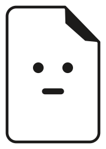
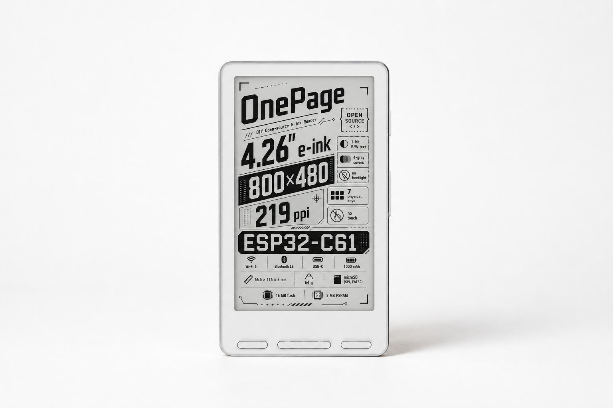

<div align="center">

<a href="https://github.com/MoveCall/onepage-reader">
  <picture>
    <source media="(prefers-color-scheme: dark)" srcset="assets/logo-dark.svg">
    
  </picture>
</a>

# OnePage Reader

**Open-Hardware DIY E-Reader Ecosystem**  
*Firmware · Custom Board · Enclosure · Browser Tools*

<br/>

[](https://www.espressif.com/)
[](https://github.com/MoveCall/crosspoint-onepage/releases)
[](electronics/c61/)
[](https://makerworld.com.cn/zh/@MoveCall)
[](#licensing)

<br/>



<br/>
<br/>

</div>

---

##  Overview

**OnePage** is an open-hardware DIY e-reader built around the **ESP32-C61** RISC-V wireless SoC. 

This repository serves as the central hub of the entire ecosystem: it houses the complete electronic fabrication packages (schematic, PCB, BOM, iBOM) and mechanical panel files, while aggregating the firmware, board SDK, and web companion tools via Git submodules.

---

##  Key Features

- **Next-Gen ESP32-C61**: Low-power RISC-V core with integrated Wi-Fi 6 and BLE.
- **BLE Page-Turner Remote**: Supports Bluetooth remote page turning with battery monitoring, key swapping, and live scanning.
- **Web Companion Tools**:
  - **Web Serial Flasher**: Flash firmware directly from Chromium-based browsers without local toolchain setups.
  - **Online Font Tool (`cpfont`)**: In-browser CJK font subsetting and glyph rasterization.
- **Production-Ready Hardware**: Complete gerbers, pick-and-place files, schematic PDF, and interactive BOM (iBOM).
- **Hybrid Craftsmanship**: Clean PET front and acrylic rear panels with an optional CNC mid-frame and MakerWorld 3D printable shell.

---

##  Ecosystem & Repositories

| Component | Submodule / Link | Description |
|:---|:---|:---|
|  **Firmware** | [`firmware/`](firmware) → [crosspoint-onepage](https://github.com/MoveCall/crosspoint-onepage) | Port of [CrossPoint Reader](https://github.com/crosspoint-reader/crosspoint-reader) tailored for OnePage C61 (`v0.1.0`). |
|  **Board SDK** | *(Nested in firmware)* → [onepage-reader-sdk-arduino](https://github.com/MoveCall/onepage-reader-sdk-arduino) | Arduino & PlatformIO board-support drivers (EPD, keys, power management, SD). |
|  **Electronics** | [`electronics/c61/`](electronics/c61/) | Schematic, Gerbers, BOM, iBOM, and SMT pick-and-place data. |
|  **Enclosure & Panels** | [`mechanical/c61/`](mechanical/c61/) → [MakerWorld](https://makerworld.com.cn/zh/@MoveCall) | Custom PET / Acrylic panels (`.epanm`), CNC mid-frame, and MakerWorld 3D models. |
|  **Web Tools** | [`web/`](web) → [onepage-reader-web](https://github.com/MoveCall/onepage-reader-web) | Official website, WebSerial flasher, and `cpfont` builder. |

---

##  Quick Start

### 1. Clone with all Submodules

To clone the entire project including firmware, drivers, and web tools in one shot:

```bash
git clone --recursive git@github.com:MoveCall/onepage-reader.git
```

If you already cloned without `--recursive`:
```bash
git submodule update --init --recursive
```

### 2. Flash Firmware via Browser

No need to install Python or compilation toolchains — visit the Web Flasher from Chrome / Edge to flash the latest release via USB-C:
[Open Web Flasher](https://github.com/MoveCall/onepage-reader-web)

---

##  Repository Layout

```text
onepage-reader/
├── firmware/        Submodule → crosspoint-onepage (nested: onepage-reader-sdk-arduino)
├── web/             Submodule → onepage-reader-web (browser flasher & font tools)
├── electronics/     PCB design, schematics & fabrication files per hardware variant
│   └── c61/
├── mechanical/      Panels (.epanm), CNC models (.stl) & MakerWorld 3D model links
│   └── c61/
└── assets/          Logos, graphics & media assets
```

---

##  Licensing

This is a **mixed-license** project designed to balance open hardware collaboration with design protection:

- **Electronics & Docs** (this repository): **[CC-BY-SA-4.0](https://creativecommons.org/licenses/by-sa/4.0/)** (`/electronics` may additionally carry **CERN-OHL-S** for hardware designs).
- **Firmware & SDK**: **[MIT](firmware/LICENSE)** (preserves CrossPoint Reader copyright).
- **3D Enclosure**: **[MakerWorld Exclusive License](https://makerworld.com.cn/zh/@MoveCall)** — 3D printable models are distributed exclusively via MakerWorld and are **not** stored directly in this repository.
- **OnePage Name & Logo**: All Rights Reserved.

---

##  Acknowledgements

- Built on top of the [CrossPoint Reader](https://github.com/crosspoint-reader/crosspoint-reader) project (MIT © Dave Allie). *(Not affiliated with CrossPoint or Xteink)*.
- Powered by Espressif ESP32-C61 & Open-Source Community.
